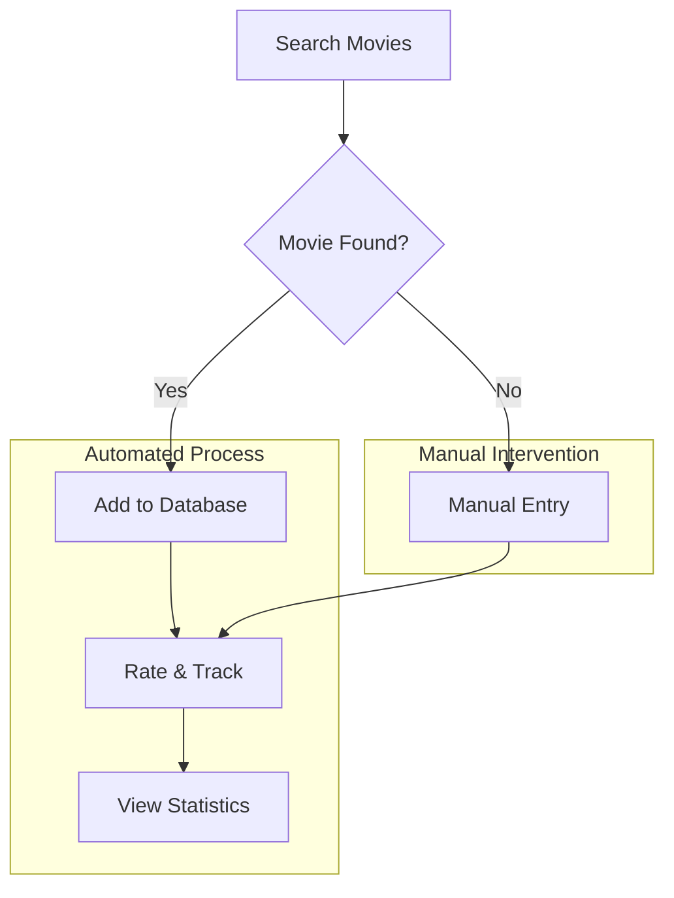

# ReelTracker Movie Management
Personal movie tracking application that runs locally on your computer.

## What This Does
ReelTracker helps you organize your movie watching by maintaining watchlists, tracking viewing history, and rating films you've seen. The system searches movie databases to find film details, stores your personal data locally in a private database, and provides statistics about your viewing habits. Users receive a web interface for managing their movie collection and viewing analytics through charts and timelines.

## Quick Start
- **To check if it's working:** Open http://localhost:5000 in your browser after starting
- **To restart if needed:** `python3 app.py`
- **If problems persist:** See [docs/TECHNICAL.md](docs/TECHNICAL.md)

## System Flow
This diagram shows how ReelTracker processes movie data from search to storage.



**Key Points:**
- Most movies are found automatically through TMDB API integration
- Manual entry is available when automatic search fails
- All personal data stays on your local computer

## Technical Overview

Flask web application with SQLite database for local movie tracking and analytics.

**Technology Stack:** Python Flask, SQLite, Chart.js, TMDB API
**Schedule:** Runs on-demand when user starts the application
**Dependencies:** Internet connection for movie search, local database for storage
**Monitoring:** Check application logs and web interface responsiveness

## Quick Setup

```bash
git clone https://github.com/wryan14/reel-tracker.git
cd reel-tracker
pip install -r requirements.txt
python3 app.py
```

**Key Files:**
- app.py: Main application server and routing logic
- reeltracker.db: SQLite database storing all user data

## Documentation

- **[docs/TECHNICAL.md](docs/TECHNICAL.md)** - Developer setup, architecture, troubleshooting
- **[docs/STAKEHOLDER.md](docs/STAKEHOLDER.md)** - Business impact and strategic value

## License

This project is licensed under the MIT License - see the [LICENSE](LICENSE) file for details.