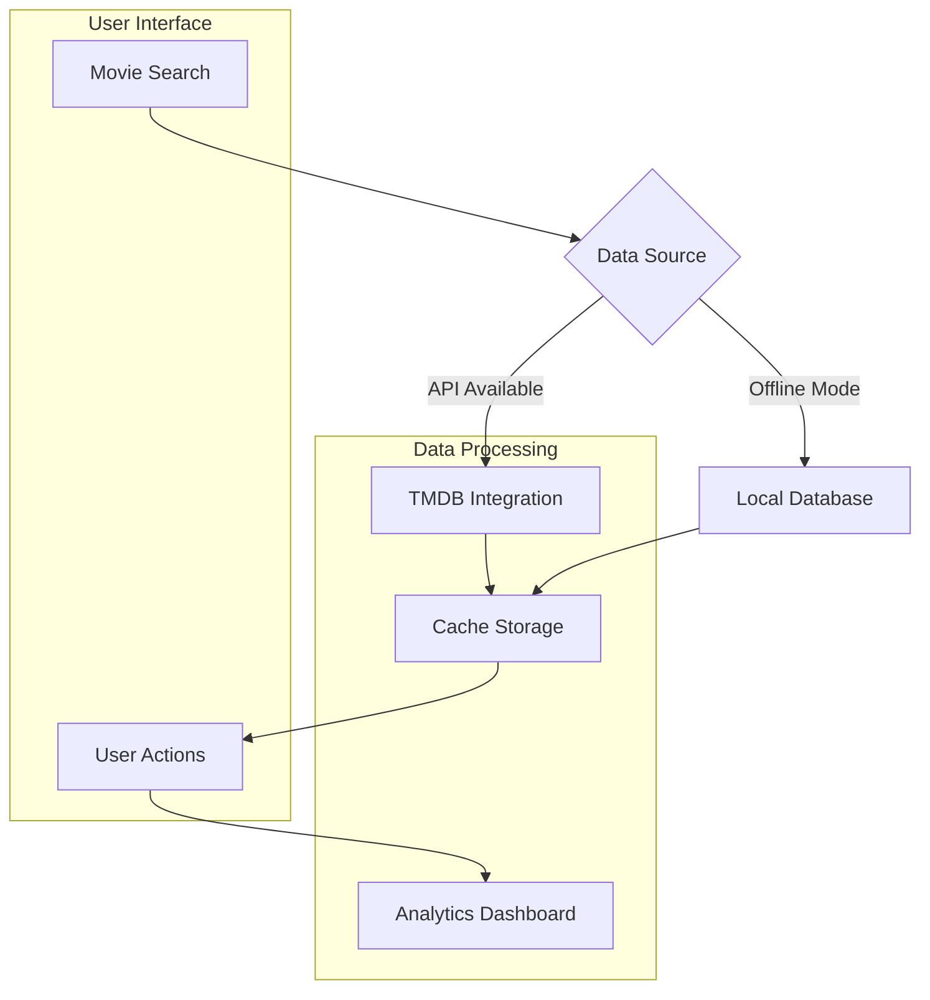

# ReelTracker
A minimalist web application for personal movie tracking that runs locally and integrates with movie databases for comprehensive viewing analytics.

## What This Does
ReelTracker helps individuals track their movie watching habits through a clean, accessible interface. Users search for movies, maintain personalized watchlists, rate films, and view statistical insights about their viewing patterns. The system processes movie data from The Movie Database (TMDB) API with local SQLite storage for offline functionality. Users receive visual analytics showing rating distributions, genre preferences, viewing timelines, and personalized statistics to understand their movie consumption habits.

## Quick Start
**To check if it's working:** Visit http://localhost:5000 after starting the application
**To restart if needed:** `python3 app.py` in the project directory
**If problems persist:** See [docs/TECHNICAL.md](docs/TECHNICAL.md) or contact the development team

## System Flow
The diagram shows how ReelTracker processes movie data from search to analytics generation.



**Key Points:**
- System operates with or without internet connectivity using local database fallback
- All movie interactions (ratings, watchlist, viewing history) generate analytics automatically
- Manual data entry available when API services are unavailable

## Technical Overview

Flask web application with SQLite database providing movie tracking functionality through responsive web interface.

**Technology Stack:** Python Flask, SQLite, TMDB API, Chart.js, vanilla JavaScript
**Schedule:** Runs on-demand when user starts the application locally
**Dependencies:** TMDB API key (optional), Python 3.8+, Flask, requests library
**Monitoring:** Application logs to console, database integrity via built-in checks

## Quick Setup

```
python3 -m venv venv
source venv/bin/activate
pip install -r requirements.txt
cp .env.example .env
python3 app.py
```

**Key Files:**
- `.env`: API keys and configuration settings
- `reeltracker.db`: SQLite database with all user data
- `app.py`: Main Flask application entry point

## Documentation

- **docs/TECHNICAL.md** - Developer setup, architecture, troubleshooting
- **docs/STAKEHOLDER.md** - Business impact and strategic value
- **DESIGN_SYSTEM.md** - UI/UX design principles and accessibility standards

## Contact

Development Team - For technical issues, feature requests, or deployment questions